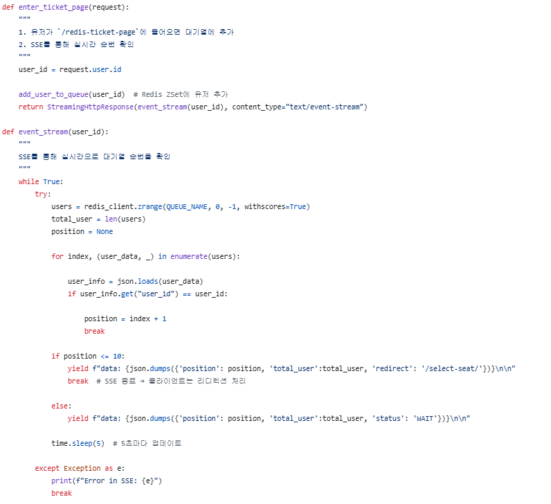
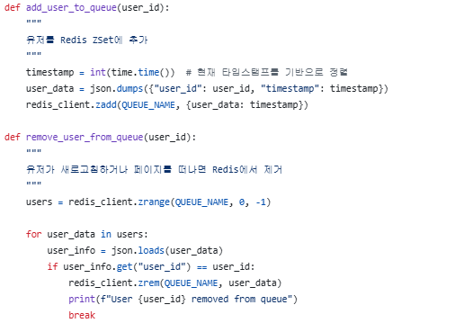
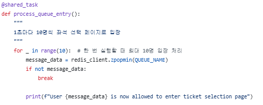
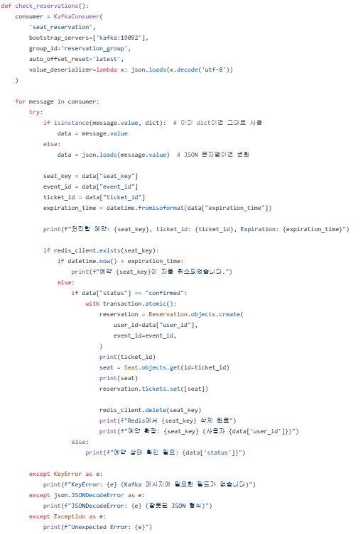
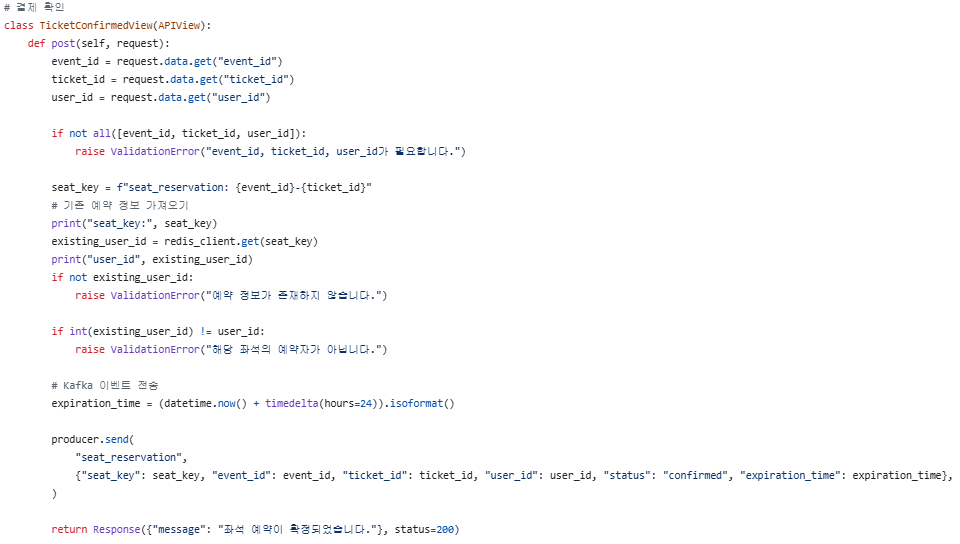

# 분산 메시징과 비동기 처리를 활용한 티켓 예약 시스템

> **개인 공부용 프로젝트**   **개발기간: 2024.11 ~ 2025.02**

## 프로젝트 소개

본 프로젝트는 분산 메시징 및 비동기 처리를 활용한 실시간 티켓 예약 시스템입니다. 높은 트래픽 환경에서도 안정적으로 티켓을 예약할 수 있도록 Kafka, Celery, Redis를 도입하여 비동기 작업 처리 및 메시지 큐 시스템을 구현하였습니다.

 

## **사용 기술 스택**

| **분야**           | **기술 스택**                         |
| ------------------ | ---------------------------------- |
| **백엔드**        | Django, Django Rest Framework      |
| **비동기 처리**   | Celery, Redis                      |
| **메시징 시스템** | Kafka                              |
| **데이터베이스**  | PostgreSQL                         |
| **인프라**        | Docker                        |
| **테스트**        | Locust (부하 테스트)       |

 

## 주요 기능

### 비동기 로그인 처리
#### 코드 이미지

 

### 실시간 대기열 (SSE 기반 처리)
#### 구현 이미지

#### 코드 이미지

  
  

    
    
  

 

### 예매 기한 만료 시 취소 & 확정 처리 (Kafka 기반 예약 처리)
#### 구현 이미지

#### 코드 이미지

  
  

    
  

 

### Locust Test
#### 테스트 결과

#### 회고
[블로그](https://jongseoung.tistory.com/351)
